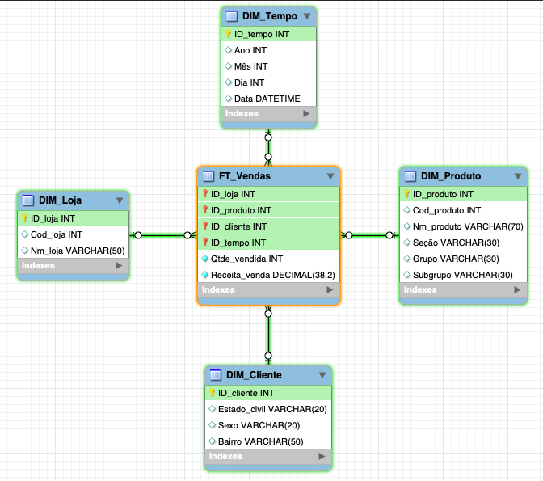
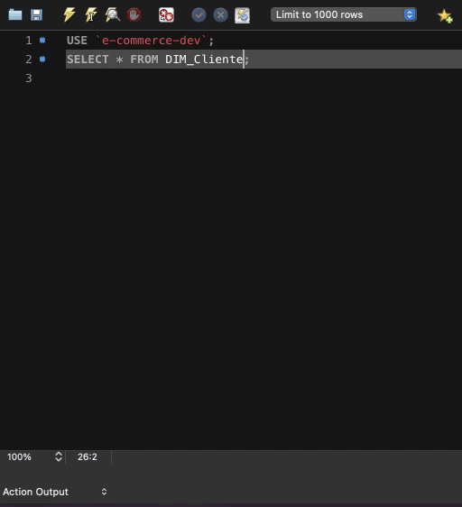

<!-- PROJECT LOGO -->
<br />
<p align="center">
    
  </a>
  
  <p align="center">
    Projeto - Modelo de Dados E-Commerce 
  </p>
</p>

<hr>

<!-- Índice -->
# Índice

* [Sobre o projeto](#sobre-o-projeto)
* [Tecnologias utilizadas](#tecnologias-utilizadas)
* [Rodando localmente](#rodando-localmente)

<br>

<!-- Sobre o projeto -->
# Sobre o projeto
<div>
Projeto desenvolvido com o objetivo de modelar um banco de dados de uma loja de e-commerce, com modelo de dados previamente disponibilizado, visando verificar sua funcionalidade, avaliando melhorias para futuras construções de relatórios.

<br>

A aplicação popula um banco de dados MySQL com o ORM (Mapeamento objeto-relacional) Sequelize através de <strong>Schemas</strong>, <strong>Migrations</strong> e <strong>Seeders</strong>, contidos nas pastas src/models, src/migrations e src/seeders, respectivamente.
<br>

Com isso, através de ferramentas visuais de gerenciamento de banco de dados MySQL (Workbench, por exemplo), é possível realizar queries e consultas nas tabelas criadas com a aplicação, identificando funcionalidades e melhorias no modelo.
<br>

O projeto também conta com testes do procedimento de inserção e obtenção de dados.

<br>

  <div align="center">
    
  </div>

</div>

<p align="center">
    Queries e visualização das tabelas com o MySQL Workbench 
</p>

<br>
<br>

# Tecnologias utilizadas
Essas foram as principais ferramentas utilizadas durante o desenvolvimento do projeto:
* <span>Node</span>
* <span>Sequelize</span>
* <span>Javascript</span>
* <span>MySQL</span>
* <span>Jest</span>

<br>

<!-- Rodando localmente -->
# Rodando localmente

### Pré-requisitos:

* Node instalado.
<br>

### Iniciando o projeto:
1. Clone o repositório em uma pasta de seu computador:

```sh
git clone git@github.com:mathlaza/elogroup.git
```

2. Entre na pasta raiz do projeto;
```sh
cd elogroup && cd e-commerce
```

3. Instale as dependências:
```sh
npm install
```

4. Renomeie o arquivo .env.example para .env e substitua os dados das variáveis por suas credenciais locais;

5. Rode a aplicação, criando e populando o banco de dados:
```sh
npm start
```
<strong>OBS</strong>: Foi utilizado Express (framework para construção de API), com o intuito de possíveis implementações futuras de rotas e novas funcionalidades para a aplicação, rodando o servidor na porta 3000. Caso queira somente criar e popular o banco, rode:
```sh
npm run db:reset
```

<br>

* Para rodar os testes:
```sh
npm test
```
* Para rodar o linter:
```sh
npm run lint
```
